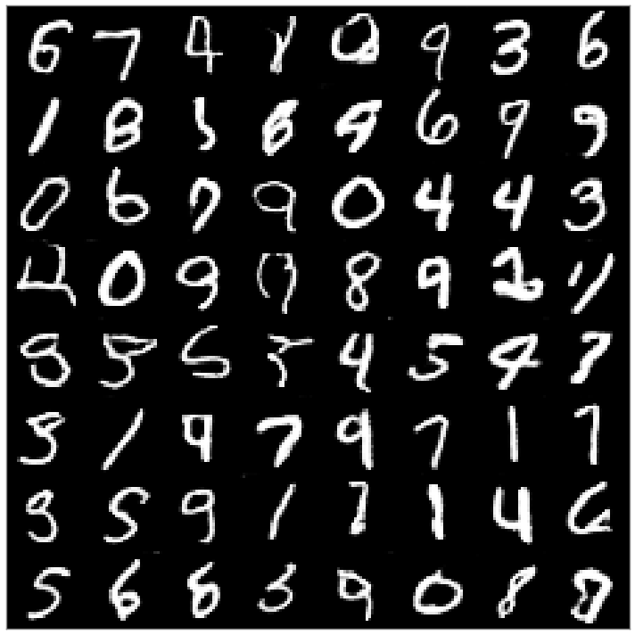
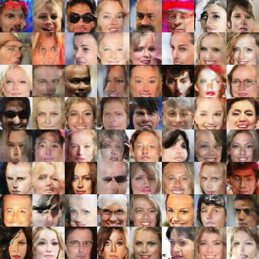
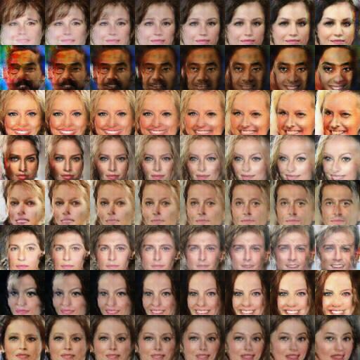

# DCGAN

An Implementation of the Paper:
[Unsupervised Representation Learning with Deep Convolutional Generative Adverserial Networks](https://arxiv.org/abs/1511.06434v2)
by [Alec Radford](https://www.linkedin.com/in/alecradford), [Luke Metz](http://lukemetz.com/), [Soumith Chintala](http://soumith.ch/)

## Generated "Fake" Samples
### Forged Digits

### Forged Faces

## Interpolation
### MNIST

### celebA

## Vector Arithmetic (a + b - c)

### Follow my Trello Board Here:
https://trello.com/c/zQ1W5Amp/16-dcgan