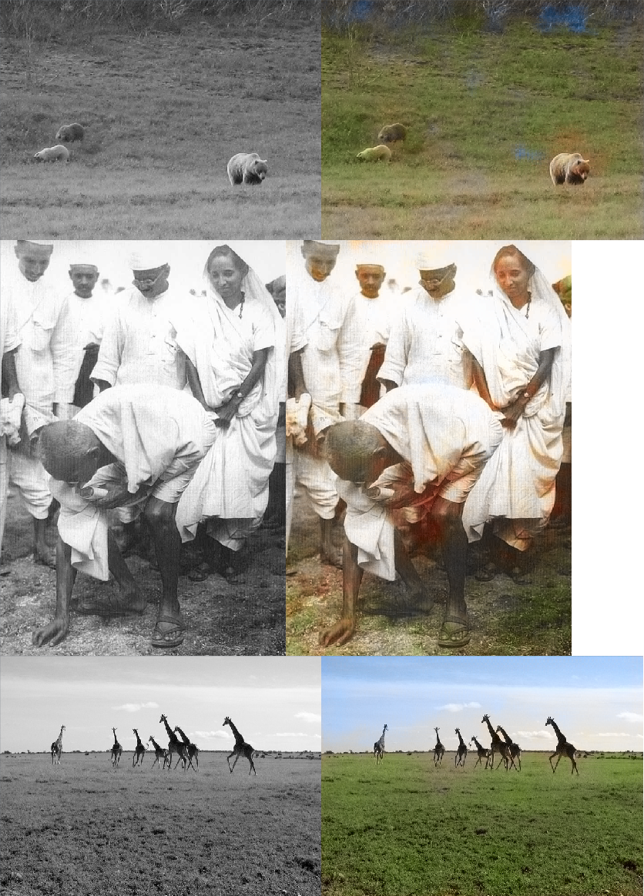

# Colorful Image Colorization
Based on the paper:
[Colorful Image Colorization](https://arxiv.org/abs/1603.08511) by [Richard Zhang](https://richzhang.github.io/), [Phillip Isola](http://people.eecs.berkeley.edu/~isola/) and [Alexei A. Efros](https://people.eecs.berkeley.edu/~efros/)

The validation set of [MS COCO 2017 dataset](http://cocodataset.org/#download) was used since my memory specs were shoddy at the time.

_Note: The Model has sort of converged to an expected local minimum with the small dataset.
Notice that it tries to paint open, upper regions of the image blue and lower regions green._