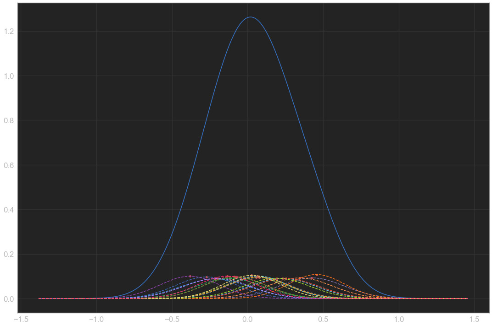
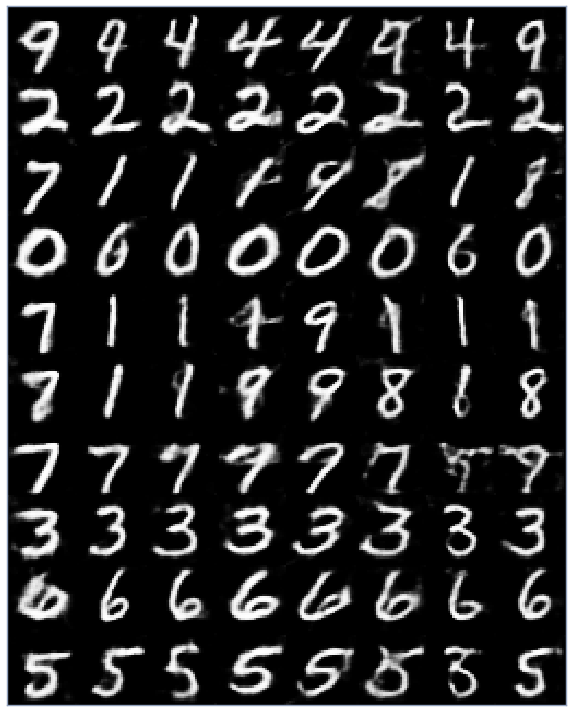

# GAN Experiments

A set of **volatile** experiments with GANs

1.[DCGAN-Classifier](Notebooks/DCGAN-Classifier.ipynb) - What happens when the discriminator of a DCGAN is trained not only to identify real images from fake ones but also to classify?

2.[DCGAN-Predictive](Notebooks/DCGAN-Predictive.ipynb) - Since the discriminator predicts on a generated image which itself is a function of a few latent variables,...
why not train the discriminator on the latent space itself?

3.[ConceptGAN](Notebooks/ConceptGAN.ipynb) ([Trello Board](https://trello.com/c/SXKRVBqH/3-gans-for-style-transfer)) - The WGAN critic is simply an estimator for the wasserstein distance between the real and fake distribution.

Here's the idea.

We first train a WGAN on some _content_ images, say natural images.
Then, we train a separate WGAN on some _concept_ images, say cartoons.

We take the critic networks of both the networks and train a WGAN generator with the sum of both critics fixed.

The hope is that the generator learns to generate images that are similar to both the content and the concept.

This is, in a way, concept transfer.

4.[ReGAN](Notebooks/ReGAN.ipynb) - Train a GAN to draw. The previous image is fed as input to the generator, which then generates the next frame.

5.[InfoGAN-Multimodal](Notebooks/InfoGAN-Multimodal.ipynb) ([Trello Board](https://trello.com/c/HDzAV81T/17-multimodal-infogan)) - A letdown of the InfoGAN is that it requires explicit knowledge of:
a) The number of continuous variables.
b) The number of categorical variables and the number of categories in each.

That's a lot.

The idea here is simple - model both categorical and conditional variables as a mixture of Gaussians (something that is inspired by [DeLiGAN](https://arxiv.org/abs/1706.02071)).

My hope was that if the variable represented a continuous variable, either all modes would collapse or the precisions would converge. If it represented an N-categorical variable, the modes would collapse into N modes and the precisions there would go to infinity.

6.[InfoGAN-Saturated](Notebooks/InfoGAN-Saturated.ipynb) - What happens when we have zero noise variables in an InfoGAN?
Answer: Good quality images (with little diversity).

7.[InfoWGAN](Notebooks/InfoWGAN.ipynb) ([Trello Board](https://trello.com/c/Xwn9bVrZ/20-infogan-addition-to-wgan-gp)) - What happens when we put the InfoGAN together with the WGAN?

