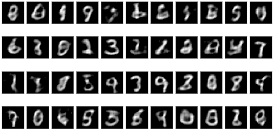

# Variational Autoencoder

## Notebooks
The [VAE](Notebooks/VAE.ipynb) notebook is a naive implementation. 
The variants using convolutions are prefixed with DC (Deep Convolutional as in DCGAN).

The variants on the CIFAR10 dataset are suffixed with CIFAR10.

The [VAE-Classifier](Notebooks/VAE-Classifier.ipynb) notebook is an experiment where we feed in the labels at training time to the generator.
At test time, desired labels are fed and we expect the generator to produce the disired digit.

## [Follow my Trello Board](https://trello.com/c/k4BmTb1D/9-variational-autoencoder)