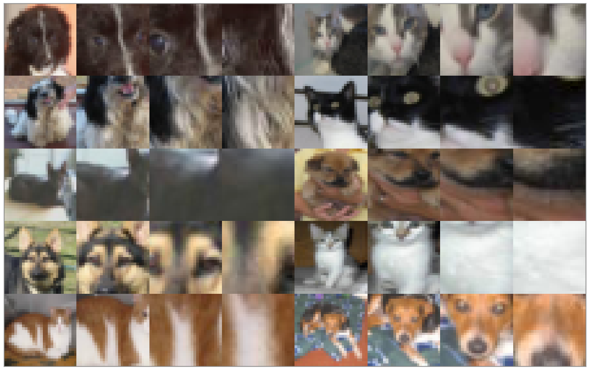
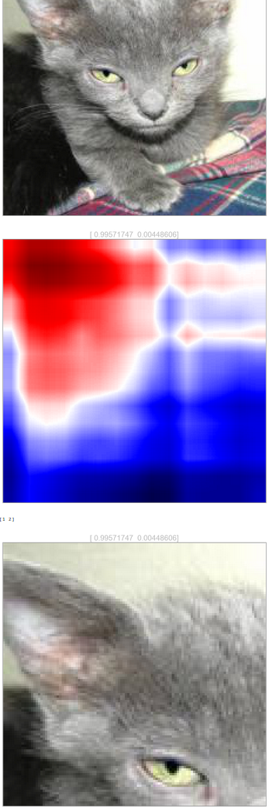

This folder asks the following questions:

1. [CatDog-Grads](Notebooks/CatDog-Grads.ipynb) - What if we backpropagated the gradients of the classification upto the input image? Do we get a saliency map?

2. [CatDog-Fuzzy](Notebooks/CatDog-Fuzzy.ipynb) - What if we do this?
a. First classify on a smaller resolution version of the image and then find the saliency map like the above.
b. Find an appropriate region to focus on using this saliency map.
c. Crop this region of the image out from a high-res version of the image.
d. Feed this high-res cropped region to the net to further refine the prediction.

3. [CatDog-Resnet](Notebooks/CatDog-Resnet.ipynb) - What if we did something that was actually useful? What if we used a ResNet?

