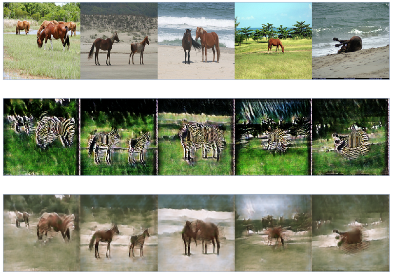
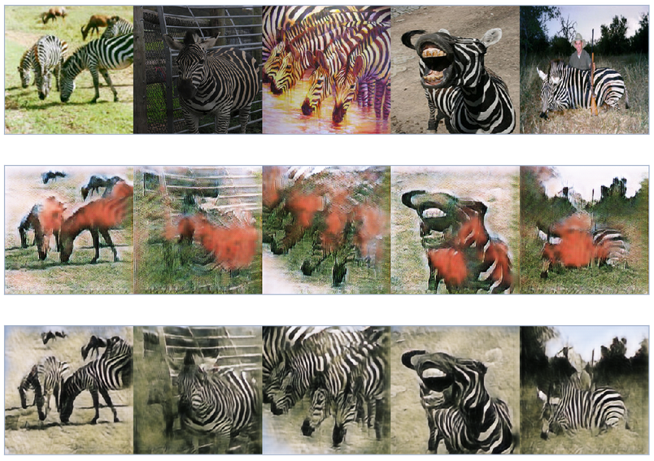
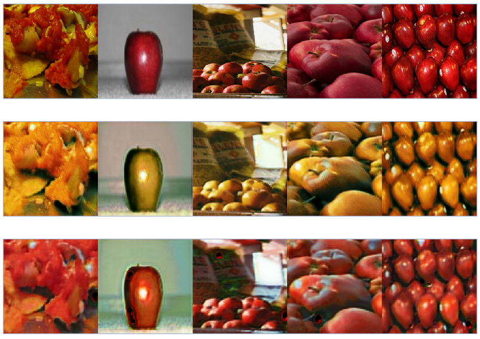
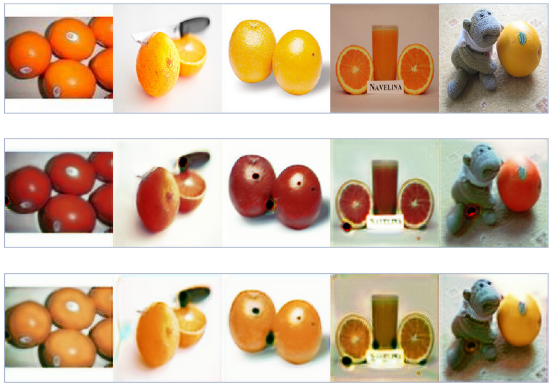

# CycleGAN

Based on the paper:
[Unpaired Image-to-Image Translation using Cycle-Consistent Adversarial Networks](https://arxiv.org/abs/1703.10593) by
[Jun-Yan Zhu](http://people.eecs.berkeley.edu/~junyanz/), [Taesung Park](https://taesung.me/), [Phillip Isola](http://people.eecs.berkeley.edu/~isola/) and [Alexei A. Efros](https://people.eecs.berkeley.edu/~efros/)

## Samples
### Horse --> Zebra --> Horse

### Zebra --> Horse --> Zebra

### Apple --> Orange --> Apple

### Orange --> Apple --> Orange

## Architecture

[Source](https://hardikbansal.github.io/CycleGANBlog/)

Clearly, the model is finding sub-optimal solutions.

In case of the Apple2Orange dataset, the model simply transforms the whole image's colors to map orange to red!

## [Follow my Trello Board](https://trello.com/c/V0RKPw4y/24-cyclegan-unpaired-image-to-image-translation-using-cycle-consistent-adversarial-networks)