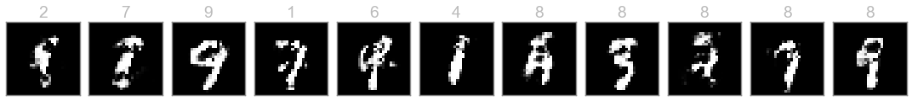

# Generative Adverserial Network

Based on the seminal Paper:
[Generative Adversarial Networks](https://arxiv.org/abs/1406.2661) by
[Ian J. Goodfellow](https://en.wikipedia.org/wiki/Ian_Goodfellow), [Jean Pouget-Abadie](https://jean.pouget-abadie.com/), [Mehdi Mirza](http://memimo.net/), [Bing Xu](https://scholar.google.co.in/citations?user=nHh9PSsAAAAJ&hl=en), [David Warde-Farley](https://uk.linkedin.com/in/david-warde-farley-55a0825), [Sherjil Ozair](https://www.linkedin.com/in/sherjil-ozair-7105b838), [Aaron Courville](https://aaroncourville.wordpress.com/), [Yoshua Bengio](https://en.wikipedia.org/wiki/Yoshua_Bengio)

## Samples

## Architecture

Souce: [Deeplearning4j](https://deeplearning4j.org/generative-adversarial-network)

_Note: This is a very naive implementation of the GAN.
For advanced flavours, poke around this repo ;)_

## [Follow my Trello Board](https://trello.com/c/QGEZbka1/4-generative-adverserial-networks)