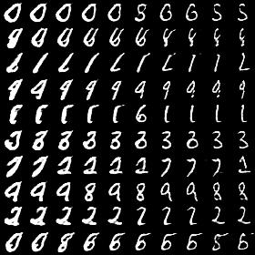
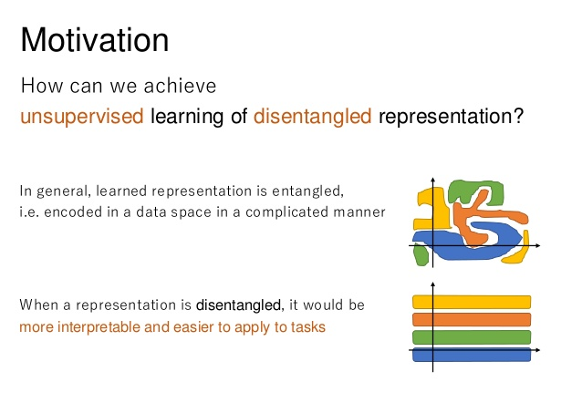

# InfoGAN

Based on the paper:

[InfoGAN: Interpretable Representation Learning by Information Maximizing Generative Adversarial Nets](https://arxiv.org/abs/1606.03657) by
[Xi Chen](http://peterchen.io/), [Yan Duan](http://rockyduan.com/), [Rein Houthooft](http://reinhouthooft.github.io/), [John Schulman](http://joschu.net/), [Ilya Sutskever](http://www.cs.toronto.edu/~ilya/) and [Pieter Abbeel](https://people.eecs.berkeley.edu/~pabbeel/)

## Samples

### Categorical

### Rotation

### Thickness

Source: [Jaejun Yoo](http://jaejunyoo.blogspot.com/2017/03/infogan-1.html)

_Note: For more interesting experiments with InfoGAN click [here](https://github.com/svaisakh/aiprojects/blob/master/Experiments/GANs/Others/Notebooks) and [here](https://github.com/svaisakh/aiprojects/tree/master/Experiments/GANs/InfoGANMultimodal)_

## [Follow my Trello Board](https://trello.com/c/OjFdJg9P/3-infogan)