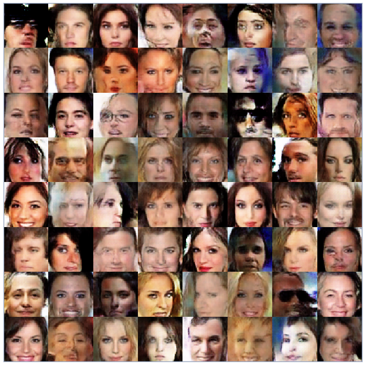
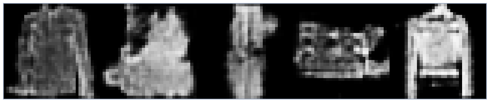

# Improved WGAN

Based on the paper:
[Improved Training of Wasserstein GANs](https://arxiv.org/abs/1704.00028) by
[Ishaan Gulrajani](https://scholar.google.com/citations?user=E2SLBwIAAAAJ&hl=en), [Faruk Ahmed](https://scholar.google.co.in/citations?user=eo9JtywAAAAJ&hl=en&oi=sra), [Martin Arjovsky](https://scholar.google.co.in/citations?user=A6qfFPkAAAAJ&hl=en), [Vincent Dumoulin](https://scholar.google.co.in/citations?user=mZfgLA4AAAAJ&hl=en) and [Aaron Courville](https://scholar.google.com/citations?user=km6CP8cAAAAJ&hl=en)

## Samples
celebA Dataset

Fashion MNIST Dataset

## [Follow my Trello Board](https://trello.com/c/C86GbEcM/1-wasserstein-gan-with-gradient-penalty)