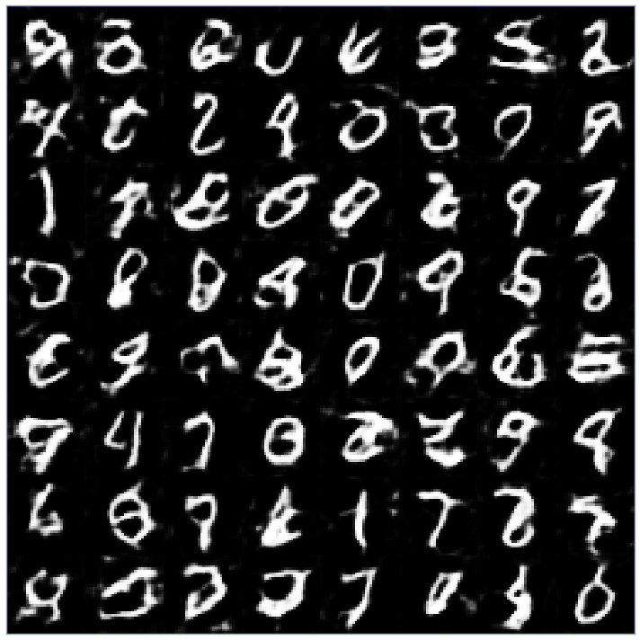
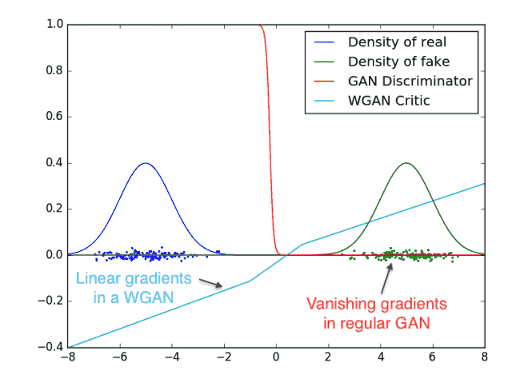

# Wasserstein GAN

Based on the paper:
[Wasserstein GAN](https://arxiv.org/abs/1701.07875) by
[Martin Arjovsky](https://scholar.google.co.in/citations?user=A6qfFPkAAAAJ&hl=en), [Soumith Chintala](http://soumith.ch/) and [Léon Bottou](http://leon.bottou.org/)

Source: Paper

## [Follow my Trello Board](https://trello.com/c/IWzawi0x/2-wasserstein-gan)