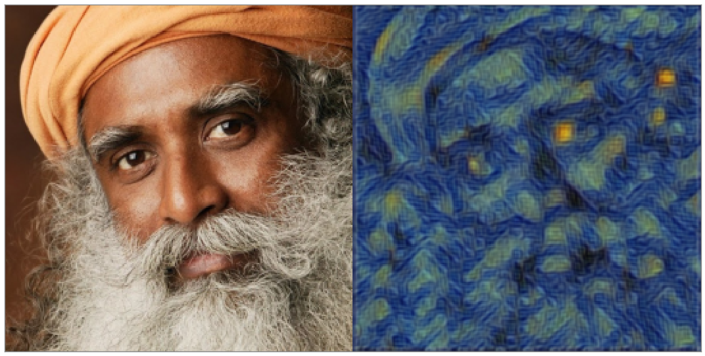

# Style Transfer & Super Resolution

Based on the paper:
[Perceptual Losses for Real-Time Style Transfer and Super-Resolution](https://arxiv.org/abs/1603.08155) by
[Justin Johnson](https://cs.stanford.edu/people/jcjohns/), [Alexandre Alahi](http://web.stanford.edu/~alahi/), [Li Fei-Fei](http://vision.stanford.edu/feifeili/)

[Sadhguru Jaggi Vasudev](https://en.wikipedia.org/wiki/Jaggi_Vasudev) as envisioned by [Vincent van Gough](https://en.wikipedia.org/wiki/Vincent_van_Gogh).

## Scripts
The [trainer](StyleTransfer/Scripts) and painter files can be used for training and sampling from the Style Transfer model respectively.

## [Follow my Trello Board](https://trello.com/c/7eCYrU8Z/21-perceptual-losses-for-real-time-style-transfer-and-super-resolution)